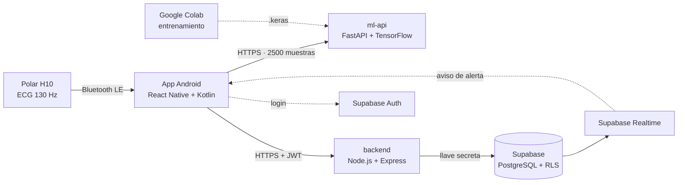

# CardioAlert

**Monitoreo cardíaco en tiempo real con un sensor Polar H10 e inteligencia artificial, para equipos de emergencia prehospitalaria.**

Una banda **Polar H10** mide el electrocardiograma (ECG) del paciente, una app Android lo recibe por Bluetooth y un modelo **CNN-BiLSTM** lo clasifica como **Normal**, **Fibrilación auricular** o **Isquemia miocárdica**, explicando qué parte de la señal motivó la decisión. Si hay una anomalía, el paramédico envía una alerta que el médico del hospital recibe al instante.

> Proyecto de tesis de Ingeniería de Sistemas (UPC). Es un prototipo académico de **soporte** a la decisión clínica, validado con datos públicos de PhysioNet: no es un dispositivo médico certificado y no reemplaza el criterio de un profesional de salud.

📄 **Documentación completa en PDF:** [Manual de clonación y despliegue](manual/Manual-clonacion-CardioAlert.pdf) · [Manual técnico](manual/Manual-tecnico-CardioAlert.pdf)

---

## Contenido

- [Arquitectura](#arquitectura)
- [Qué hay en este repositorio](#qué-hay-en-este-repositorio)
- [Requisitos](#requisitos)
- [Clonar y desplegar](#clonar-y-desplegar)
  - [1 · Clonar](#1--clonar)
  - [2 · Base de datos (Supabase)](#2--base-de-datos-supabase)
  - [3 · Modelo de IA (Google Colab)](#3--modelo-de-ia-google-colab)
  - [4 · API de IA](#4--api-de-ia)
  - [5 · Backend](#5--backend)
  - [6 · App y APK](#6--app-y-apk)
  - [7 · Verificación](#7--verificación)
- [Cómo se integró el Polar H10](#cómo-se-integró-el-polar-h10)
- [Adaptarlo a otros usos](#adaptarlo-a-otros-usos)
- [Seguridad](#seguridad)
- [Solución de problemas](#solución-de-problemas)

---

## Arquitectura



| Pieza | Tecnología | Dónde se aloja |
|---|---|---|
| App móvil | React Native 0.87 (TypeScript) + módulo nativo Kotlin | APK en celulares Android 13+ |
| Sensor | Polar H10 + [Polar BLE SDK](https://github.com/polarofficial/polar-ble-sdk) 8.3 | Pecho del paciente |
| Backend | Node.js 22 + Express 5 + Zod | Railway (o Render, Docker) |
| API de IA | Python 3.12 + FastAPI + TensorFlow 2.20 | Railway (o Render, Docker) |
| Base de datos | Supabase: PostgreSQL, Auth, Realtime | Supabase (nube o autoalojado) |
| Entrenamiento | Notebook de Google Colab (GPU T4) | Solo al entrenar |

**Roles:** el **paramédico** conecta el sensor, monitorea y envía alertas; el **médico** recibe y responde alertas en el Monitor Hospital; el **administrador** crea las cuentas de paramédicos y médicos.

---

## Qué hay en este repositorio

```
cardioalert/
├── CardioAlertMobile/   App React Native; android/ incluye el módulo Kotlin del Polar
├── backend/             API Express: /sessions  /alerts  /users
├── ml-api/              API de IA: /predict  /explain  + modelo entrenado (.keras)
├── supabase/schema.sql  Tablas, seguridad por rol (RLS) y tiempo real
├── training/            Notebook de Colab que genera el modelo
├── deploy/              Dockerfiles y docker-compose (alojamiento alternativo)
└── manual/              Manuales en PDF
```

Las **llaves no están en el repositorio**: cada quien crea sus propias cuentas y llaves. Los archivos `.env` están excluidos de Git; en su lugar hay plantillas `.env.example`.

---

## Requisitos

**Cuentas** (todas tienen plan gratuito para empezar): GitHub, [Supabase](https://supabase.com), [Railway](https://railway.app) u otra plataforma y, solo para reentrenar, Google (Colab + Drive).

**Herramientas locales:**

| Herramienta | Versión | Para qué | macOS |
|---|---|---|---|
| Git | cualquiera | Clonar | `xcode-select --install` |
| Node.js | 22+ | App y backend | `brew install node` |
| JDK | 17 | Compilar Android | `brew install openjdk@17` |
| Android SDK | plataforma 37, NDK 27.1 | Generar el APK | `brew install --cask android-commandlinetools` |
| Python | 3.12 (no 3.13+) | API de IA en local | `brew install python@3.12` |
| Docker | opcional | Alojar con Docker | Docker Desktop |

**Hardware:** celular Android 13 o superior y una banda Polar H10 (opcional: sin ella la app usa ECG simulado).

**Costos aproximados:** Supabase Free (gratis), Railway desde ~5 USD/mes, Colab gratis. La API de IA necesita ~1 GB de RAM por TensorFlow, así que los planes gratuitos de 512 MB no alcanzan.

---

## Clonar y desplegar

El orden importa: cada pieza necesita la dirección de la anterior.
**Base de datos → modelo → API de IA → backend → app.**

### 1 · Clonar

Haz un **Fork** en GitHub (para desplegarlo y modificarlo) y clónalo:

```bash
git clone https://github.com/TU_USUARIO/cardioalert.git
cd cardioalert
```

### 2 · Base de datos (Supabase)

1. **New project** en supabase.com. En *Security*, deja marcadas *Enable Data API* y *Automatically expose new tables*, y marca *Enable automatic RLS*.
2. **SQL Editor → New query**, pega todo `supabase/schema.sql`, selecciona todo y **Run**.
3. Verifica. Debe dar **4 tablas · 8 políticas · 1 trigger**:
   ```sql
   select
     (select count(*) from information_schema.tables where table_schema = 'public'
        and table_name in ('profiles','sessions','classifications','alerts')) as tablas,
     (select count(*) from pg_policies where schemaname = 'public') as politicas,
     (select count(*) from pg_trigger where tgname = 'on_auth_user_created') as trigger;
   ```
4. Copia las llaves:

   | Dato | Dónde | Va en |
   |---|---|---|
   | Project URL | Project Settings → Data API | App y backend |
   | Publishable key (`sb_publishable_…`) | Project Settings → API Keys | **Solo la app** |
   | Secret key (`sb_secret_…`) | Project Settings → API Keys | **Solo el backend** |

5. **Primer administrador:** en *Authentication → Users → Add user*, créalo con *Auto confirm user* marcado. Después asígnale el rol:
   ```sql
   update public.profiles
   set role = 'admin', full_name = 'Administrador'
   where id = (select id from auth.users where email = 'admin@tu-dominio.com');
   ```
   Desde ahí, el administrador crea paramédicos y médicos dentro de la app.

### 3 · Modelo de IA (Google Colab)

El repo ya trae el modelo entrenado en `ml-api/model/cardioalert_cnn_bilstm.keras`. **Puedes saltarte este paso.**

Para reentrenarlo o adaptarlo a otras clases:

1. En [Colab](https://colab.research.google.com): *Archivo → Subir notebook* → `training/CardioAlert_entrenamiento_corregido.ipynb`.
2. *Entorno de ejecución → Cambiar tipo → **T4 GPU***, y luego *Ejecutar todo*. Pide acceso a tu Drive.
3. Descarga ~1.2 GB desde PhysioNet (30–90 min la primera vez; queda guardado en Drive) y entrena (10–20 min).
4. Reemplaza el `.keras` en `ml-api/model/` y haz `git push`.

El notebook usa **exactamente el mismo preprocesamiento que la app** (250 Hz, filtro 0.5–40 Hz, z-score), hace que cada base de datos aporte casos normales y patológicos, y divide los datos **por paciente**. Con `QUICK_TEST = True` se comprueba en minutos que todo corre.

### 4 · API de IA

Genera una clave para protegerla: `openssl rand -hex 24`.

**Railway**

1. *New Project → Deploy from GitHub repo* → tu fork.
2. *Settings*: **Root Directory** `/ml-api` · **Watch Paths** `/ml-api/**`.
3. *Variables*: `ML_API_KEY`. **No definas `PORT`.**
4. *Deploy*. Tarda 3–5 min (TensorFlow). Python 3.12 se toma de `.python-version` y el arranque del `Procfile`.
5. *Networking → Generate Domain* (puerto `8080`). Esa URL es `ML_API_URL` en la app.

**Render:** Web Service con Root Directory `ml-api`, Build `pip install -r requirements.txt`, Start `uvicorn main:app --host 0.0.0.0 --port $PORT`, variables `ML_API_KEY` y `PYTHON_VERSION=3.12.7`, y un plan con ≥1 GB de RAM.

**Docker** (servidor propio, Cloud Run, Fly.io):

```bash
docker build -f deploy/ml-api.Dockerfile -t cardioalert-ml-api ml-api
docker run -d -p 8000:8000 -e ML_API_KEY=tu-clave cardioalert-ml-api
```

Comprobación: `curl https://TU-ML-API/health` → `{"status":"ok","model_loaded":true,...}`

### 5 · Backend

Variables: `SUPABASE_URL` y `SUPABASE_SERVICE_ROLE_KEY` (la **secret key**).

**Railway:** en el mismo proyecto, *+ Create → GitHub Repo* → tu fork · **Root Directory** `/backend` · **Watch Paths** `/backend/**` · las dos variables · *Deploy* · *Generate Domain*. Esa URL es `API_BASE_URL` en la app.

**Render:** Root Directory `backend` · Build `npm install && npm run build` · Start `npm start`.

**Docker Compose** (backend y API de IA juntos en un VPS):

```bash
cp backend/.env.example backend/.env    # completa SUPABASE_URL y la secret key
cd deploy
cp .env.example .env                    # completa ML_API_KEY (y puertos si hace falta)
docker compose up -d --build
```

> ⚠️ **HTTPS es obligatorio:** el APK final bloquea las conexiones `http://`. En un servidor propio pon delante un proxy con certificado, por ejemplo [Caddy](https://caddyserver.com):
> ```
> api.tu-dominio.com {
>     reverse_proxy localhost:3000
> }
> ia.tu-dominio.com {
>     reverse_proxy localhost:8000
> }
> ```

Comprobación: `curl https://TU-BACKEND/health` → `{"ok":true}`. Sin login, `/sessions` responde `401`, que es lo correcto.

### 6 · App y APK

Es un proyecto **React Native sin Expo**: la interfaz está en TypeScript y dentro de `android/` hay un proyecto Android con un **módulo nativo en Kotlin** que usa el SDK oficial de Polar. La configuración se lee de `.env` y **queda incrustada al compilar**.

```bash
cd CardioAlertMobile
npm install
cp .env.example .env
```

| Variable | Valor |
|---|---|
| `SUPABASE_URL` | Project URL |
| `SUPABASE_ANON_KEY` | La **publishable** key (nunca la secret) |
| `API_BASE_URL` | URL del backend (`https://`) |
| `ML_API_URL` · `ML_API_KEY` | URL y clave de la API de IA. Vacías = modo de simulación |
| `ALERT_CONFIDENCE_THRESHOLD` | Confianza mínima para alertar (`0.85`) |

> Si `SUPABASE_URL` se deja con el valor de ejemplo, la app arranca en **modo demo**: datos locales y cualquier login. Sirve para ver la interfaz sin montar nada.

**SDK de Android** (una sola vez, macOS con Homebrew):

```bash
export JAVA_HOME=/opt/homebrew/opt/openjdk@17/libexec/openjdk.jdk/Contents/Home
export ANDROID_HOME=/opt/homebrew/share/android-commandlinetools
yes | sdkmanager --licenses
sdkmanager "platform-tools" "platforms;android-37.0" "build-tools;37.0.0" "ndk;27.1.12297006"
echo "sdk.dir=$ANDROID_HOME" > android/local.properties
```

**Generar el APK:**

```bash
cd android
./gradlew assembleRelease -PreactNativeArchitectures=arm64-v8a   # Windows: gradlew.bat
```

El APK queda en `android/app/build/outputs/apk/release/app-release.apk` (~36 MB). **Cada cambio en `.env` exige volver a generarlo.**

**Desarrollo en vivo** (celular por USB con depuración activada): `npm start` en una terminal y `npm run android` en otra.

**Distribución:** el APK se instala a mano (permitir "orígenes desconocidos"). Está firmado con la llave de depuración de React Native; para Google Play hay que firmarlo con una llave propia ([guía oficial](https://reactnative.dev/docs/signed-apk-android)).

### 7 · Verificación

| Comprobación | Esperado |
|---|---|
| Consulta del paso 2 | 4 tablas · 8 políticas · 1 trigger |
| `GET ml-api/health` | `model_loaded: true` |
| `POST ml-api/predict` sin `X-API-Key` | `401` |
| `GET backend/health` | `{"ok":true}` |
| `GET backend/sessions` sin login | `401` |
| Login con rol **Admin** | Abre "Administración" |
| Crear un paramédico y un médico | Aparecen en la lista |
| Paramédico → Buscar Polar H10 | El sensor aparece y conecta |
| Iniciar monitoreo | A los 10 s aparece el diagnóstico con la etiqueta "MODELO IA" |
| Enviar una alerta (Perfil → Simulación → Isquemia) | Le aparece al médico al instante |

---

## Cómo se integró el Polar H10

El H10 transmite el ECG en bruto (130 Hz, µV) con un protocolo propio de Polar (PMD), así que se usa el **[Polar BLE SDK](https://github.com/polarofficial/polar-ble-sdk)** oficial, distribuido por JitPack:

```gradle
// android/build.gradle
allprojects { repositories { maven { url "https://jitpack.io" } } }

// android/app/build.gradle  (minSdkVersion 33, exigido por el SDK 8)
implementation("com.github.polarofficial:polar-ble-sdk:8.3.0")
implementation("org.jetbrains.kotlinx:kotlinx-coroutines-android:1.10.2")
```

Como el SDK es nativo (Kotlin), se expone a React Native con un **Native Module** (`PolarModule.kt`):

```
Polar H10 ──BLE──▶ Polar BLE SDK ──Kotlin Flow──▶ PolarModule.kt ──eventos──▶ App (TypeScript)
```

| Función del SDK | Uso |
|---|---|
| `PolarBleApiDefaultImpl.defaultImplementation()` | Instancia con HR, streaming en línea, batería e información del dispositivo |
| `searchForDevice()` | Lista de sensores cercanos |
| `connectToDevice(id)` | Conexión al tocar un sensor |
| `requestStreamSettings(id, ECG)` + `maxSettings()` | Mejor configuración de ECG |
| `startEcgStreaming(id, ajustes)` | ECG en vivo: voltaje (µV) y marca de tiempo (ns) por muestra |
| `startHrStreaming(id)` | BPM e intervalos R-R |

El módulo envía a JavaScript los eventos `PolarDeviceFound`, `PolarConnectionState`, `PolarEcgData`, `PolarHrData`, `PolarBattery` y `PolarError`, que la app escucha con `NativeEventEmitter`. Los permisos `BLUETOOTH_SCAN` y `BLUETOOTH_CONNECT` se piden en tiempo de ejecución.

---

## Adaptarlo a otros usos

| Quiero… | Qué cambiar |
|---|---|
| Otro nombre de app | `app_name` en `android/app/src/main/res/values/strings.xml` |
| Instalarla junto a la original | `applicationId` en `android/app/build.gradle` |
| Otro hospital receptor o umbral | `RECEIVING_HOSPITAL` en `src/config.ts` · `ALERT_CONFIDENCE_THRESHOLD` en `.env` |
| Otras patologías o clases | La misma lista y el mismo orden en `CLASSES` (notebook y `ml-api/main.py`) y en `LABELS` (`src/ml/types.ts`), más `classification_type` en `schema.sql` y los esquemas Zod del backend |
| Otro modelo | Cualquier Keras con entrada `(2500, 1)` y una probabilidad por clase: reemplaza el `.keras` |
| IA sin internet | Exportar a TensorFlow Lite y usar `react-native-fast-tflite` (punto de entrada en `src/ml/classifier.ts`) |
| Otro sensor Polar | El mismo SDK; ajustar el streaming del módulo Kotlin (por ejemplo PPG) |
| Sensor de otra marca | Un módulo nativo nuevo que emita los mismos eventos; el resto de la app no cambia |
| iPhone | Portar `PolarModule.kt` a Swift con el Polar SDK de iOS |
| Base de datos propia | Supabase autoalojado con Docker, con el mismo `schema.sql` |

---

## Seguridad

- **Genera tus propias llaves.** La **secret key** de Supabase solo va en el servidor: con ella se salta toda la seguridad de la base de datos.
- **No subas archivos `.env`** (ya están en `.gitignore`); revisa `git status` antes de cada commit.
- Las cuatro tablas tienen **Row Level Security**: cada paramédico ve solo lo suyo y sin sesión no se ve nada.
- Los pacientes se identifican con códigos anónimos (`PAC-1234`).
- La clave de la API de IA va dentro del APK: frena el uso casual, pero puede extraerse. Para uso real, la API debería validar el login de Supabase.
- Las cuentas de administrador solo se crean desde el panel de Supabase.

---

## Solución de problemas

| Síntoma | Solución |
|---|---|
| Railway: "Application not found" | El despliegue no terminó o falló: revisa *Deployments → View logs* |
| La API de IA se reinicia | Falta RAM: usa un plan con ≥1 GB |
| Error instalando TensorFlow | Usa Python 3.12 |
| El dominio responde con error | No definas `PORT` a mano en Railway (el dominio va al 8080) |
| "SDK location not found" | Crea `android/local.properties` con `sdk.dir=…` |
| La app ignora el `.env` nuevo | Vuelve a generar el APK |
| La app no conecta con el backend | Usa `https://` (el APK bloquea `http://`) |
| "Esta cuenta no tiene el rol…" | Elige el rol correcto o corrige `role` en `profiles` |
| El Polar no aparece | Humedece los electrodos, ajústalo al pecho, activa Bluetooth y ubicación, y cierra Polar Flow/Beat |
| El APK no instala | Requiere Android 13 o superior |
| `docker compose`: puerto ocupado | Cambia `BACKEND_PORT` / `ML_API_PORT` en `deploy/.env` |

---

**Datos de entrenamiento:** [PhysioNet](https://physionet.org): MIT-BIH Arrhythmia Database, MIT-BIH Atrial Fibrillation Database y European ST-T Database.
**Explicabilidad:** XAI por perturbación (Paralič et al., 2023).
